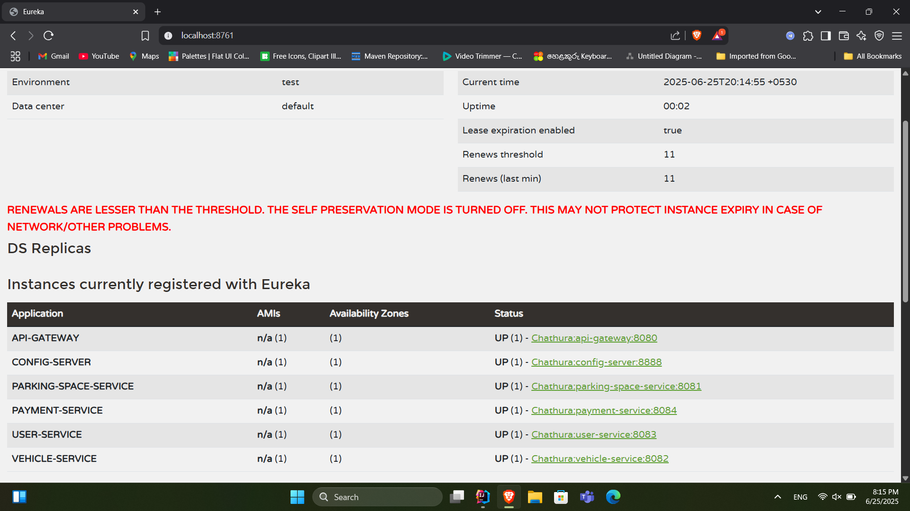

# 🚗 Smart Parking Management System (SPMS)

A cloud-native, microservice-based backend platform to manage and optimize real-time urban parking operations. SPMS allows drivers to book parking spots, vehicle owners to simulate usage, and parking providers to manage spaces with digital payments and receipts — all powered by Spring Boot microservices.

---

## 🌐 System Overview

Urban cities face critical challenges with parking congestion and inefficient space use. SPMS solves this by introducing a modular microservices architecture designed to:

- Dynamically track and allocate parking spaces
- Simulate vehicle entry/exit
- Handle secure payment transactions
- Provide real-time booking visibility
- Offer insights by zone/city

---

## 🎯 Core Business Features

- 🔐 User authentication and management  
- 🚗 Vehicle registration and usage simulation  
- 🅿️ Parking space creation, reservation, and live availability  
- 💳 Payment processing with digital receipt generation (PDF)  
- 📊 Admin-level data views and historical usage logs  

---

## 🛠️ Technologies Used

| Technology            | Role                                                     |
|-----------------------|----------------------------------------------------------|
| Spring Boot           | Core framework for all microservices                     |
| Spring Web            | RESTful API development                                  |
| Spring Cloud Eureka   | Service discovery and registration                       |
| Spring Cloud Config   | Centralized config management                            |
| Spring Cloud Gateway  | API Gateway for routing                                  |
| Postman               | API testing and simulation                               |
| Optional: Flask / Node.js | For lightweight service alternatives (not used here) |

---

## 🧩 Microservice Architecture

### 🛰️ Eureka Server (Service Discovery)
- Registers all microservices dynamically.
- Enables internal communication without hardcoded URLs.

### ⚙️ Config Server (Central Config)
- Shared config values (e.g., ports, DB URLs) managed in a single place.

### 🌐 API Gateway
- Public entry point to the backend
- Routes requests to: `/users`, `/vehicles`, `/parking-spaces`, `/payments`

### 🔧 Business Microservices

| Service Name       | Port   | Description |
|--------------------|--------|-------------|
| **User Service**   | `8083` | Registers, authenticates, and manages users |
| **Vehicle Service**| `8082` | Registers vehicles, simulates entries, tracks stats |
| **Parking Service**| `8081` | Manages space availability, reservations, IoT updates |
| **Payment Service**| `8084` | Processes payments and generates PDF receipts |

---

## 📂 Folder Structure

```
SPMS/
├── user-service/
├── vehicle-service/
├── parking-service/
├── payment-service/
├── eureka-server/
├── config-server/
├── api-gateway/
├── postman_collection.json
├── docs/
│   └── screenshots/
│       └── eureka_dashboard.png
└── README.md
```

---

## 📬 Postman Collection

All REST API endpoints have been **fully tested** using Postman.

- 🔗 [Postman Collection](ParkingManagementSystem.postman_collection.json)
- Contains endpoints for:
  - ✅ User Registration & Login
  - ✅ Vehicle Entry/Exit Simulation
  - ✅ Parking Reservation & Occupancy
  - ✅ Payment Processing & Receipt Download

---

## 📸 Eureka Dashboard

Here’s the live registration of services visible via Eureka:



---

## 🔄 Example Workflow

1. User registers and logs in → `POST /users/register`, `POST /users/authenticate`  
2. User registers a vehicle → `POST /vehicles`  
3. User searches and reserves a parking spot → `GET /parking-spaces/available`, `POST /parking-spaces/reserve`  
4. Vehicle enters parking → `POST /vehicles/entry`  
5. Payment is made → `POST /payments`  
6. Receipt is generated → `GET /payments/{paymentId}/receipt`  

---

## 🧪 Testing Strategy

- All endpoints tested via Postman collection  
- Edge cases tested: invalid inputs, missing fields, unauthorized access  
- Focused on backend logic (no frontend)  
- Services tested independently and via API Gateway  

---

## 📈 Future Enhancements

- Real IoT integration for automated space occupancy tracking  
- Admin dashboard for space/traffic insights  
- Notification service for booking and payment alerts  
- Kubernetes deployment for scalable hosting  

---

## ✅ Conclusion

SPMS is a scalable, decoupled backend built using Spring Boot microservices, solving real-world urban parking challenges. With full support for modular deployment, real-time service discovery, and secure digital payments, it’s ready to power future-ready smart cities.

> 🚦 Smarter Cities. Greener Mobility. Seamless Parking.

---

## 📬 Contact

Have questions or suggestions? Feel free to reach out:

- 📧 **Email**: chathuhiru45@gmail.com  
- 🐙 **GitHub**: [Chathura0607](https://github.com/Chathura0607)

---
